# 💸 HƯỚNG DẪN REFUND SYSTEM - BOOKSTATION

## 🎯 TỔNG QUAN HỆ THỐNG HOÀN TIỀN

BookStation hỗ trợ **2 loại hoàn tiền**:
1. **Partial Refund** - Hoàn tiền 1 phần (trả lại một vài sản phẩm)
2. **Full Refund** - Hoàn tiền toàn bộ đơn hàng

**✅ Các trường hợp hoàn tiền:**
- Sản phẩm lỗi, không đúng mô tả
- Khách hàng không hài lòng (trong 7 ngày)
- Admin quyết định hoàn tiền do lỗi hệ thống
- Hủy đơn hàng trước khi ship

---

## 🔄 1. REFUND BUSINESS LOGIC

### 📋 Quy trình hoàn tiền

```mermaid
graph TD
    A[Yêu cầu hoàn tiền] --> B[Validate Order Status]
    B --> C{Order Status?}
    C -->|COMPLETED| D[Có thể hoàn tiền]
    C -->|SHIPPING| E[Chờ nhận hàng để hoàn tiền]
    C -->|CANCELLED| F[Đơn đã hủy, không hoàn tiền]
    C -->|PENDING| G[Hủy đơn thay vì hoàn tiền]
    
    D --> H[Chọn loại hoàn tiền]
    H --> I{Partial or Full?}
    I -->|Partial| J[Hoàn tiền 1 phần]
    I -->|Full| K[Hoàn tiền toàn bộ]
    
    J --> L[Cập nhật stock]
    K --> L
    L --> M[Cập nhật voucher usage]
    M --> N[Tạo refund record]
    N --> O[Hoàn tiền thành công]
```



### 💰 Công thức tính tiền hoàn

#### **Full Refund**
```java
BigDecimal fullRefundAmount = order.getTotalPrice();
// Bao gồm: subtotal + shipping - discounts
```

#### **Partial Refund**
```java
// Công thức: (Price × Quantity) - (Voucher discount theo tỷ lệ)
BigDecimal itemSubtotal = orderDetail.getUnitPrice().multiply(BigDecimal.valueOf(refundQuantity));
BigDecimal proportionalDiscount = calculateProportionalDiscount(order, orderDetail, refundQuantity);
BigDecimal refundAmount = itemSubtotal.subtract(proportionalDiscount);
```

---

## 🛠️ 2. REFUND SERVICE IMPLEMENTATION

### 📡 RefundService Interface

```java
public interface RefundService {
    ApiResponse<RefundResponse> createFullRefund(Integer orderId, String reason, Integer adminId);
    ApiResponse<RefundResponse> createPartialRefund(Integer orderId, PartialRefundRequest request, Integer adminId);
    ApiResponse<List<RefundResponse>> getRefundsByOrder(Integer orderId);
    ApiResponse<String> processRefund(Integer refundId, RefundStatus newStatus, Integer adminId);
}
```

### 🔄 Full Refund Implementation

```java
@Service
@Transactional
public class RefundServiceImpl implements RefundService {
    
    @Autowired
    private OrderRepository orderRepository;
    
    @Autowired
    private RefundRepository refundRepository;
    
    @Autowired
    private BookRepository bookRepository;
    
    @Autowired
    private VoucherRepository voucherRepository;
    
    public ApiResponse<RefundResponse> createFullRefund(Integer orderId, String reason, Integer adminId) {
        // 1. VALIDATE ORDER
        Order order = orderRepository.findById(orderId).orElseThrow(
            () -> new RuntimeException("Đơn hàng không tồn tại")
        );
        
        if (order.getStatus() != OrderStatus.COMPLETED) {
            return new ApiResponse<>(400, "Chỉ có thể hoàn tiền đơn hàng đã hoàn thành", null);
        }
        
        // 2. CHECK EXISTING REFUNDS
        List<Refund> existingRefunds = refundRepository.findByOrderIdAndStatus(orderId, RefundStatus.APPROVED);
        BigDecimal totalRefunded = existingRefunds.stream()
            .map(Refund::getRefundAmount)
            .reduce(BigDecimal.ZERO, BigDecimal::add);
            
        BigDecimal remainingAmount = order.getTotalPrice().subtract(totalRefunded);
        if (remainingAmount.compareTo(BigDecimal.ZERO) <= 0) {
            return new ApiResponse<>(400, "Đơn hàng đã được hoàn tiền đầy đủ", null);
        }
        
        // 3. CREATE REFUND RECORD
        Refund refund = new Refund();
        refund.setOrder(order);
        refund.setRefundType(RefundType.FULL);
        refund.setRefundAmount(remainingAmount);
        refund.setReason(reason);
        refund.setStatus(RefundStatus.PENDING);
        refund.setRequestedBy(adminId);
        refund.setRequestedAt(System.currentTimeMillis());
        
        Refund savedRefund = refundRepository.save(refund);
        
        // 4. RESTORE STOCK (All items)
        for (OrderDetail detail : order.getOrderDetails()) {
            restoreStock(detail);
        }
        
        // 5. RESTORE VOUCHER USAGE
        restoreVoucherUsage(order);
        
        // 6. AUTO-APPROVE FOR ADMIN REQUESTS
        if (adminId != null) {
            savedRefund.setStatus(RefundStatus.APPROVED);
            savedRefund.setProcessedBy(adminId);
            savedRefund.setProcessedAt(System.currentTimeMillis());
            refundRepository.save(savedRefund);
        }
        
        log.info("✅ FULL REFUND CREATED: Order {} refund amount {}", orderId, remainingAmount);
        
        return new ApiResponse<>(201, "Tạo yêu cầu hoàn tiền thành công", 
            refundResponseMapper.toResponse(savedRefund));
    }
}
```

### 🔄 Partial Refund Implementation

```java
public ApiResponse<RefundResponse> createPartialRefund(Integer orderId, PartialRefundRequest request, Integer adminId) {
    // 1. VALIDATE ORDER
    Order order = orderRepository.findById(orderId).orElseThrow();
    
    if (order.getStatus() != OrderStatus.COMPLETED) {
        return new ApiResponse<>(400, "Chỉ có thể hoàn tiền đơn hàng đã hoàn thành", null);
    }
    
    // 2. VALIDATE REFUND ITEMS
    List<PartialRefundItem> refundItems = request.getRefundItems();
    BigDecimal totalRefundAmount = BigDecimal.ZERO;
    
    for (PartialRefundItem item : refundItems) {
        OrderDetail orderDetail = findOrderDetail(order, item.getOrderDetailId());
        
        // Validate quantity
        int alreadyRefunded = getAlreadyRefundedQuantity(orderDetail);
        int availableForRefund = orderDetail.getQuantity() - alreadyRefunded;
        
        if (item.getRefundQuantity() > availableForRefund) {
            return new ApiResponse<>(400, 
                String.format("Sản phẩm '%s' chỉ có thể hoàn %d sản phẩm", 
                    orderDetail.getBook().getBookName(), availableForRefund), null);
        }
        
        // Calculate refund amount for this item
        BigDecimal itemRefundAmount = calculatePartialRefundAmount(order, orderDetail, item.getRefundQuantity());
        totalRefundAmount = totalRefundAmount.add(itemRefundAmount);
    }
    
    // 3. CREATE REFUND RECORD
    Refund refund = new Refund();
    refund.setOrder(order);
    refund.setRefundType(RefundType.PARTIAL);
    refund.setRefundAmount(totalRefundAmount);
    refund.setReason(request.getReason());
    refund.setStatus(RefundStatus.PENDING);
    refund.setRequestedBy(adminId);
    refund.setRequestedAt(System.currentTimeMillis());
    
    // 4. CREATE REFUND ITEMS
    Refund savedRefund = refundRepository.save(refund);
    
    for (PartialRefundItem item : refundItems) {
        RefundItem refundItem = new RefundItem();
        refundItem.setRefund(savedRefund);
        refundItem.setOrderDetail(findOrderDetail(order, item.getOrderDetailId()));
        refundItem.setRefundQuantity(item.getRefundQuantity());
        refundItem.setRefundAmount(calculatePartialRefundAmount(order, 
            findOrderDetail(order, item.getOrderDetailId()), item.getRefundQuantity()));
        refundItemRepository.save(refundItem);
        
        // 5. RESTORE STOCK
        restoreStockPartial(findOrderDetail(order, item.getOrderDetailId()), item.getRefundQuantity());
    }
    
    // 6. AUTO-APPROVE FOR ADMIN
    if (adminId != null) {
        savedRefund.setStatus(RefundStatus.APPROVED);
        savedRefund.setProcessedBy(adminId);
        savedRefund.setProcessedAt(System.currentTimeMillis());
        refundRepository.save(savedRefund);
    }
    
    log.info("✅ PARTIAL REFUND CREATED: Order {} refund amount {}", orderId, totalRefundAmount);
    
    return new ApiResponse<>(201, "Tạo yêu cầu hoàn tiền một phần thành công", 
        refundResponseMapper.toResponse(savedRefund));
}
```

---

## 📦 3. STOCK RESTORATION LOGIC

### 🔄 Full Stock Restoration

```java
private void restoreStock(OrderDetail orderDetail) {
    Book book = orderDetail.getBook();
    
    // 🔄 RESTORE REGULAR BOOK STOCK
    int newBookStock = book.getStockQuantity() + orderDetail.getQuantity();
    book.setStockQuantity(newBookStock);
    bookRepository.save(book);
    
    log.info("📦 STOCK RESTORED: Book {} stock: {} → {}", 
        book.getId(), book.getStockQuantity() - orderDetail.getQuantity(), newBookStock);
    
    // 🔄 RESTORE FLASH SALE STOCK (if applicable)
    if (orderDetail.getFlashSaleItemId() != null) {
        FlashSaleItem flashSaleItem = flashSaleItemRepository.findById(orderDetail.getFlashSaleItemId()).orElse(null);
        if (flashSaleItem != null) {
            int newFlashSaleStock = flashSaleItem.getStockQuantity() + orderDetail.getQuantity();
            flashSaleItem.setStockQuantity(newFlashSaleStock);
            flashSaleItemRepository.save(flashSaleItem);
            
            log.info("🔥 FLASH SALE STOCK RESTORED: Item {} stock: {} → {}", 
                flashSaleItem.getId(), flashSaleItem.getStockQuantity() - orderDetail.getQuantity(), newFlashSaleStock);
        }
    }
}
```

### 🔄 Partial Stock Restoration

```java
private void restoreStockPartial(OrderDetail orderDetail, int refundQuantity) {
    Book book = orderDetail.getBook();
    
    // 🔄 RESTORE REGULAR BOOK STOCK
    int newBookStock = book.getStockQuantity() + refundQuantity;
    book.setStockQuantity(newBookStock);
    bookRepository.save(book);
    
    log.info("📦 PARTIAL STOCK RESTORED: Book {} stock: {} → {} (restored: {})", 
        book.getId(), book.getStockQuantity() - refundQuantity, newBookStock, refundQuantity);
    
    // 🔄 RESTORE FLASH SALE STOCK (if applicable)
    if (orderDetail.getFlashSaleItemId() != null) {
        FlashSaleItem flashSaleItem = flashSaleItemRepository.findById(orderDetail.getFlashSaleItemId()).orElse(null);
        if (flashSaleItem != null && flashSaleItem.getStatus() == 1) { // Only if still active
            int newFlashSaleStock = flashSaleItem.getStockQuantity() + refundQuantity;
            flashSaleItem.setStockQuantity(newFlashSaleStock);
            flashSaleItemRepository.save(flashSaleItem);
            
            log.info("🔥 PARTIAL FLASH SALE STOCK RESTORED: Item {} stock: {} → {} (restored: {})", 
                flashSaleItem.getId(), flashSaleItem.getStockQuantity() - refundQuantity, newFlashSaleStock, refundQuantity);
        }
    }
}
```

---

## 🎫 4. VOUCHER USAGE RESTORATION

### 🔄 Restore Voucher Usage Logic

```java
private void restoreVoucherUsage(Order order) {
    List<OrderVoucher> orderVouchers = orderVoucherRepository.findByOrderId(order.getId());
    
    for (OrderVoucher orderVoucher : orderVouchers) {
        Voucher voucher = orderVoucher.getVoucher();
        
        // 🔄 DECREASE USED COUNT
        if (voucher.getUsedCount() > 0) {
            voucher.setUsedCount(voucher.getUsedCount() - 1);
            voucherRepository.save(voucher);
            
            log.info("🎫 VOUCHER USAGE RESTORED: {} used count: {} → {}", 
                voucher.getCode(), voucher.getUsedCount() + 1, voucher.getUsedCount());
        }
        
        // 🔄 RESTORE USER VOUCHER USAGE
        if (voucher.getMaxUsagePerUser() != null) {
            UserVoucherUsage userUsage = userVoucherUsageRepository
                .findByUserIdAndVoucherId(order.getUser().getId(), voucher.getId());
            
            if (userUsage != null && userUsage.getUsageCount() > 0) {
                userUsage.setUsageCount(userUsage.getUsageCount() - 1);
                userVoucherUsageRepository.save(userUsage);
                
                log.info("👤 USER VOUCHER USAGE RESTORED: User {} voucher {} usage: {} → {}", 
                    order.getUser().getId(), voucher.getCode(), 
                    userUsage.getUsageCount() + 1, userUsage.getUsageCount());
            }
        }
    }
}
```

---

## 💰 5. REFUND AMOUNT CALCULATION

### 🧮 Partial Refund Calculation

```java
private BigDecimal calculatePartialRefundAmount(Order order, OrderDetail orderDetail, int refundQuantity) {
    // 1. BASIC ITEM AMOUNT
    BigDecimal unitPrice = orderDetail.getUnitPrice();
    BigDecimal itemSubtotal = unitPrice.multiply(BigDecimal.valueOf(refundQuantity));
    
    // 2. CALCULATE PROPORTIONAL DISCOUNT
    BigDecimal orderSubtotal = calculateOrderSubtotal(order);
    BigDecimal totalDiscount = order.getDiscountAmount() != null ? order.getDiscountAmount() : BigDecimal.ZERO;
    
    // Tính tỷ lệ discount cho item này
    BigDecimal itemRatio = itemSubtotal.divide(orderSubtotal, 4, RoundingMode.HALF_UP);
    BigDecimal proportionalDiscount = totalDiscount.multiply(itemRatio);
    
    // 3. FINAL REFUND AMOUNT
    BigDecimal refundAmount = itemSubtotal.subtract(proportionalDiscount);
    
    log.info("💰 PARTIAL REFUND CALCULATION: Item subtotal: {}, Proportional discount: {}, Final refund: {}", 
        itemSubtotal, proportionalDiscount, refundAmount);
    
    return refundAmount.max(BigDecimal.ZERO); // Không âm
}
```

### 📊 Shipping Fee Refund Logic

```java
private boolean shouldRefundShipping(Order order, List<PartialRefundItem> refundItems) {
    // Chỉ hoàn ship fee nếu hoàn tất cả sản phẩm
    int totalOrderQuantity = order.getOrderDetails().stream()
        .mapToInt(OrderDetail::getQuantity)
        .sum();
        
    int totalRefundQuantity = refundItems.stream()
        .mapToInt(PartialRefundItem::getRefundQuantity)
        .sum();
        
    return totalRefundQuantity >= totalOrderQuantity;
}
```

---

## 📊 6. REFUND ENTITIES & DTOs

### 🗄️ Refund Entity

```java
@Entity
@Table(name = "refunds")
public class Refund {
    @Id
    @GeneratedValue(strategy = GenerationType.IDENTITY)
    private Integer id;
    
    @ManyToOne
    @JoinColumn(name = "order_id")
    private Order order;
    
    @Enumerated(EnumType.STRING)
    private RefundType refundType; // FULL, PARTIAL
    
    @Enumerated(EnumType.STRING)
    private RefundStatus status; // PENDING, APPROVED, REJECTED
    
    @Column(precision = 10, scale = 2)
    private BigDecimal refundAmount;
    
    private String reason;
    
    private Integer requestedBy; // Admin ID
    private Long requestedAt;
    
    private Integer processedBy; // Admin ID  
    private Long processedAt;
    
    private String notes; // Admin notes
    
    // Getters & Setters...
}
```

### 🗄️ RefundItem Entity (for partial refunds)

```java
@Entity
@Table(name = "refund_items")
public class RefundItem {
    @Id
    @GeneratedValue(strategy = GenerationType.IDENTITY)
    private Integer id;
    
    @ManyToOne
    @JoinColumn(name = "refund_id")
    private Refund refund;
    
    @ManyToOne
    @JoinColumn(name = "order_detail_id")
    private OrderDetail orderDetail;
    
    private Integer refundQuantity;
    
    @Column(precision = 10, scale = 2)
    private BigDecimal refundAmount;
    
    // Getters & Setters...
}
```

### 📝 Request DTOs

```java
// PartialRefundRequest
public class PartialRefundRequest {
    private String reason;
    private List<PartialRefundItem> refundItems;
    
    public static class PartialRefundItem {
        private Integer orderDetailId;
        private Integer refundQuantity;
        private String itemReason; // Optional: reason for this specific item
        
        // Getters & Setters...
    }
}

// RefundResponse
public class RefundResponse {
    private Integer id;
    private Integer orderId;
    private String orderCode;
    private RefundType refundType;
    private RefundStatus status;
    private BigDecimal refundAmount;
    private String reason;
    private Long requestedAt;
    private Long processedAt;
    private List<RefundItemResponse> refundItems; // For partial refunds
    
    // Getters & Setters...
}
```

---

## 🚀 7. API ENDPOINTS

### 📡 Refund APIs

```java
@RestController
@RequestMapping("/api/refunds")
public class RefundController {
    
    // Tạo hoàn tiền toàn bộ
    @PostMapping("/full")
    public ApiResponse<RefundResponse> createFullRefund(@RequestBody FullRefundRequest request) {
        return refundService.createFullRefund(request.getOrderId(), request.getReason(), getCurrentAdminId());
    }
    
    // Tạo hoàn tiền 1 phần
    @PostMapping("/partial")
    public ApiResponse<RefundResponse> createPartialRefund(@RequestBody PartialRefundRequest request) {
        return refundService.createPartialRefund(request.getOrderId(), request, getCurrentAdminId());
    }
    
    // Lấy danh sách refund của 1 order
    @GetMapping("/order/{orderId}")
    public ApiResponse<List<RefundResponse>> getRefundsByOrder(@PathVariable Integer orderId) {
        return refundService.getRefundsByOrder(orderId);
    }
    
    // Approve/Reject refund
    @PostMapping("/{refundId}/process")
    public ApiResponse<String> processRefund(@PathVariable Integer refundId, @RequestBody ProcessRefundRequest request) {
        return refundService.processRefund(refundId, request.getStatus(), getCurrentAdminId());
    }
    
    // Lấy tất cả refunds (admin)
    @GetMapping
    public ApiResponse<List<RefundResponse>> getAllRefunds(
        @RequestParam(defaultValue = "0") int page,
        @RequestParam(defaultValue = "20") int size,
        @RequestParam(required = false) RefundStatus status
    ) {
        return refundService.getAllRefunds(page, size, status);
    }
}
```

### 📱 Frontend Integration Example

```javascript
// Tạo full refund
async function createFullRefund(orderId, reason) {
    const response = await fetch('/api/refunds/full', {
        method: 'POST',
        headers: {
            'Content-Type': 'application/json',
            'Authorization': `Bearer ${adminToken}`
        },
        body: JSON.stringify({
            orderId: orderId,
            reason: reason
        })
    });
    
    const result = await response.json();
    
    if (result.status === 201) {
        showSuccess('Tạo yêu cầu hoàn tiền thành công!');
        refreshOrderDetails();
    } else {
        showError(result.message);
    }
}

// Tạo partial refund
async function createPartialRefund(orderId, refundItems, reason) {
    const response = await fetch('/api/refunds/partial', {
        method: 'POST',
        headers: {
            'Content-Type': 'application/json',
            'Authorization': `Bearer ${adminToken}`
        },
        body: JSON.stringify({
            orderId: orderId,
            reason: reason,
            refundItems: refundItems.map(item => ({
                orderDetailId: item.orderDetailId,
                refundQuantity: item.refundQuantity,
                itemReason: item.reason
            }))
        })
    });
    
    const result = await response.json();
    
    if (result.status === 201) {
        showSuccess('Tạo yêu cầu hoàn tiền một phần thành công!');
        refreshOrderDetails();
    } else {
        showError(result.message);
    }
}
```

---

## 🔍 8. VALIDATION & BUSINESS RULES

### ✅ Refund Validation Rules

1. **Order Status**: Chỉ có thể hoàn tiền order COMPLETED
2. **Time Limit**: Có thể set thời hạn hoàn tiền (7-30 ngày)
3. **Quantity Limit**: Không hoàn quá số lượng đã mua
4. **Amount Limit**: Tổng hoàn tiền không vượt quá tổng đơn hàng
5. **Stock Validation**: Có đủ chỗ để restore stock không

### 🚨 Error Handling

```java
// Common validation errors
public class RefundValidation {
    
    public static void validateOrderForRefund(Order order) {
        if (order.getStatus() != OrderStatus.COMPLETED) {
            throw new RefundException("Chỉ có thể hoàn tiền đơn hàng đã hoàn thành");
        }
        
        if (order.getCompletedAt() != null) {
            long daysSinceCompletion = (System.currentTimeMillis() - order.getCompletedAt()) / (1000 * 60 * 60 * 24);
            if (daysSinceCompletion > 30) {
                throw new RefundException("Đã quá thời hạn hoàn tiền (30 ngày)");
            }
        }
    }
    
    public static void validateRefundAmount(Order order, BigDecimal requestedRefund) {
        BigDecimal totalRefunded = getTotalRefundedAmount(order);
        BigDecimal remainingAmount = order.getTotalPrice().subtract(totalRefunded);
        
        if (requestedRefund.compareTo(remainingAmount) > 0) {
            throw new RefundException("Số tiền hoàn vượt quá số tiền còn lại");
        }
    }
}
```

---

## 📊 9. REPORTING & ANALYTICS

### 📈 Refund Reports

```sql
-- Tổng quan refunds theo tháng
SELECT 
    DATE_FORMAT(FROM_UNIXTIME(requested_at/1000), '%Y-%m') as month,
    COUNT(*) as total_refunds,
    SUM(refund_amount) as total_refund_amount,
    AVG(refund_amount) as avg_refund_amount
FROM refunds 
WHERE status = 'APPROVED'
GROUP BY month
ORDER BY month DESC;

-- Top reasons for refunds
SELECT 
    reason,
    COUNT(*) as count,
    SUM(refund_amount) as total_amount
FROM refunds 
WHERE status = 'APPROVED'
GROUP BY reason
ORDER BY count DESC;

-- Books with highest refund rate
SELECT 
    b.book_name,
    COUNT(ri.id) as refund_count,
    SUM(ri.refund_quantity) as total_refunded_quantity,
    SUM(od.quantity) as total_sold_quantity,
    (SUM(ri.refund_quantity) * 100.0 / SUM(od.quantity)) as refund_rate
FROM books b
JOIN order_details od ON b.id = od.book_id
JOIN refund_items ri ON od.id = ri.order_detail_id
JOIN refunds r ON ri.refund_id = r.id
WHERE r.status = 'APPROVED'
GROUP BY b.id, b.book_name
HAVING refund_rate > 5
ORDER BY refund_rate DESC;
```

### 📊 Dashboard Metrics

```java
// RefundReportService
public class RefundReportService {
    
    public RefundDashboard getDashboard(LocalDate fromDate, LocalDate toDate) {
        RefundDashboard dashboard = new RefundDashboard();
        
        // Total refunds
        dashboard.setTotalRefunds(refundRepository.countByDateRange(fromDate, toDate));
        
        // Total refund amount
        dashboard.setTotalRefundAmount(refundRepository.sumRefundAmountByDateRange(fromDate, toDate));
        
        // Refund rate
        BigDecimal totalOrderAmount = orderRepository.sumTotalPriceByDateRange(fromDate, toDate);
        BigDecimal refundRate = dashboard.getTotalRefundAmount()
            .divide(totalOrderAmount, 4, RoundingMode.HALF_UP)
            .multiply(BigDecimal.valueOf(100));
        dashboard.setRefundRate(refundRate);
        
        // Top refund reasons
        dashboard.setTopReasons(refundRepository.getTopReasonsByDateRange(fromDate, toDate));
        
        return dashboard;
    }
}
```

---

## ✅ 10. TESTING SCENARIOS

### 🧪 Unit Tests

```java
@Test
public void testFullRefundSuccess() {
    // Given
    Order order = createCompletedOrder();
    String reason = "Sản phẩm lỗi";
    
    // When
    ApiResponse<RefundResponse> response = refundService.createFullRefund(order.getId(), reason, 1);
    
    // Then
    assertEquals(201, response.getStatus());
    assertEquals(order.getTotalPrice(), response.getData().getRefundAmount());
    
    // Verify stock restored
    for (OrderDetail detail : order.getOrderDetails()) {
        Book book = bookRepository.findById(detail.getBook().getId()).get();
        assertEquals(originalStock + detail.getQuantity(), book.getStockQuantity());
    }
}

@Test
public void testPartialRefundCalculation() {
    // Given
    Order order = createOrderWithDiscount();
    OrderDetail detail = order.getOrderDetails().get(0);
    int refundQuantity = 2;
    
    // When
    BigDecimal refundAmount = refundService.calculatePartialRefundAmount(order, detail, refundQuantity);
    
    // Then
    // Verify calculation includes proportional discount
    assertTrue(refundAmount.compareTo(BigDecimal.ZERO) > 0);
    assertTrue(refundAmount.compareTo(detail.getUnitPrice().multiply(BigDecimal.valueOf(refundQuantity))) <= 0);
}
```

---

## 🚀 NEXT STEPS

1. **✅ Implemented**: Full & Partial refund logic với stock restoration
2. **📋 TODO**: 
   - Integrate với payment gateway để refund tiền thật
   - Add notification system cho refund status updates
   - Create admin dashboard cho refund management
   - Add customer refund request portal

**Happy Refunding! 💸**
